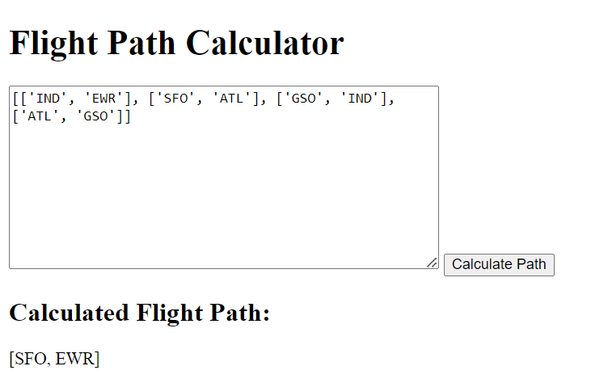

# Flight Path API

## Overview
The Flight Path API calculates the start and end points of a series of flights based on the given input. This project includes the API implementation.

## Installation

1. Clone the repository:
    git clone <repository-url>
    cd <repository-directory>

2. Install dependencies:
    npm install

## Usage

### Starting the Server
To start the server, run:
npm start

The server will be running on http://localhost:8080.

## API Endpoint

POST /calculate
This endpoint calculates the start and end points of a series of flights.

## Request Body

flights: An array of flight routes, where each route is represented as an array with two elements: the departure and the destination.

